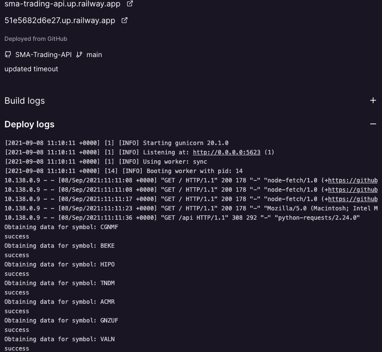

# Simple Moving Averages Trading API

The things we need to make this bot are as follows:
1. An API to connect to the stock market and make transactions
2. Identifying the stocks to trade
3. Finding a relevant trading strategy

To obtain the stock market info and stocks to trade I will be using the Alpha Vantage API and the yahoo finance website. The top 100 gainers from Yahoo finance US are scraped and obtained as a list.
For which I later use the Alpha vantage API to obtain daily time series data.  

I used the US stock market for this project, as the Indian one has not opened at the time of the making of this project. 

# The trading algorithm

I have used the moving averages technique of algorithmic trading to buy and sell stocks specified by the user. A moving average is an average of past data points that smooths out day-to-day price fluctuations and thereby identifies trends. To use this we need to compute the 200 day average and 50 day average prices of the stock. Transactions are made on the following conditions:

1. Buy shares of a stock when its 50-day moving average goes above the 200-day moving average.
2. Sell shares of the stock when its 50-day moving average goes below the 200-day moving average.

The recommendation from this algorithm along with the symbol and the current price of the stock
is converted into json data which can be requested using the API.

# Using the API

I have used heroku to host the api at the url linked. The /api route allows requesting of data in json format. To make requests to the API execute the following
python code:

```
import requests
import json

url = "https://sma-trading-api.up.railway.app/api"
r = requests.get(url)
data = r.json()
with open('results.json', 'w') as f:
    json.dump(data, f)
```
Hosted on Railway.app

This is how it works!


